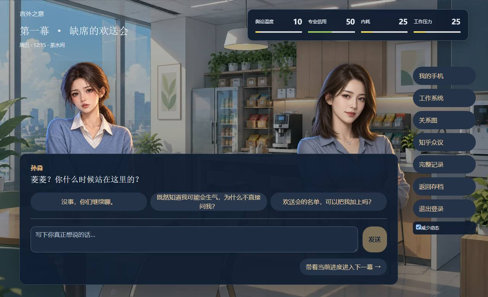
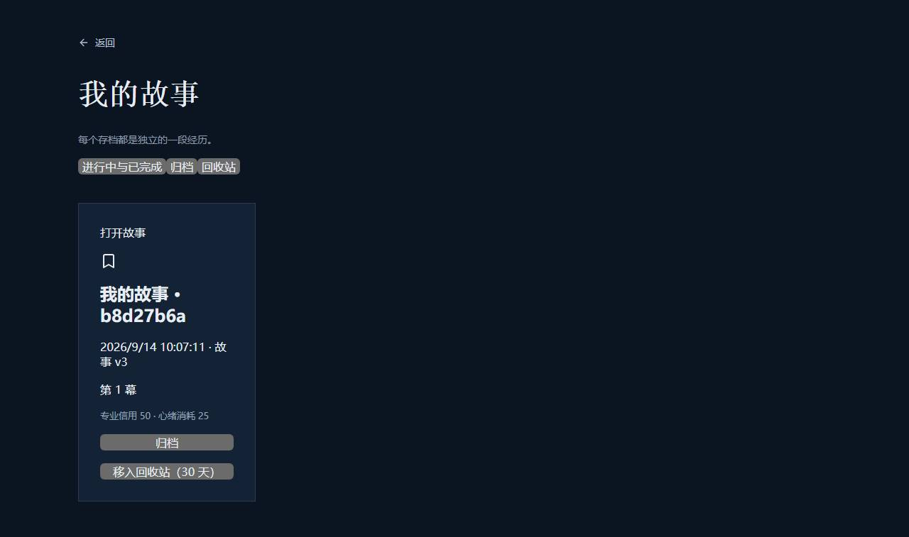
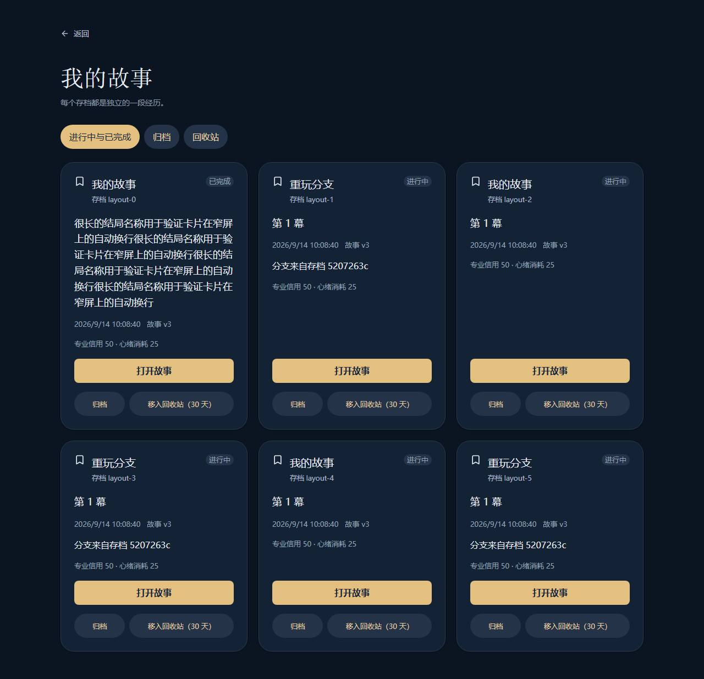

# Frontend UI migration (#3–#9)

The migration uses HeroUI 3.2.5 and Tailwind CSS 4.3.3. Versions are pinned in
`frontend/package.json` and `pnpm-lock.yaml`; the required Node 22 / pnpm 11 toolchain
is unchanged. No database migration or saved-story format change is required.

## Components and style ownership

- HeroUI Button, Form and TextArea supply shared controls across the home/saves,
  current story, legacy story and error/recovery surfaces.
- Card and Chip separate save identity, progress, status and management actions.
- Modal supplies focus containment, Escape dismissal and restored trigger focus
  for the five sidebars. CSS Modules position this accessible modal at the right
  edge, with a fixed heading and an independently scrollable body.
- Native `meter` elements retain all four metric names, values and thresholds.
  Native select, checkbox, details and critical confirmation dialogs retain their
  existing semantics and behavior; they are deliberate migration exceptions.
- Shared tokens live in `src/theme.css`. Only used HeroUI component styles are
  imported, within the `components` cascade layer. Unlayered CSS Modules own page
  geometry, illustrations and story typography. This avoids import-order-dependent
  overrides of the script button and sidebar layout.

## Behavior

The story footer groups quick choices, free text and act controls. Returning to
saves keeps the logged-in identity and per-save draft; accepted/pending actions
disable navigation until recovery finishes. Logout remains a separate action.
Reading-position writes update the query cache as well as the server, preventing
old scripted lines from replaying after returning from the save list.

The metric panel has a single high-contrast surface. All five sidebars share
spacing, fields, cards and scrolling. Work records separate submissions from
reviews and hide diagnostic event IDs in details. Relationships form a responsive
grid. Discussion/history have explicit empty and generation/error feedback.

The ending separates generated prose, saved facts, achievements and unresolved
items. Blank-line-separated prose becomes paragraphs, lists remain lists and
empty results have fallbacks. Share-card generation and saved outcomes retain
their existing behavior. Saves wrap from one to several columns, stretch the
final row, wrap long content and keep management actions in the card footer.

## Transport budget

The owner approved increasing the JavaScript gzip ceiling from **150,000 to
160,000 bytes** to retain the complete HeroUI migration. This supersedes the
historical 150 KB target in `product-v2-release.md`; image and coverage gates are
unchanged. The measured `ce0d61d` baseline is about 127 KB, compared with about
153 KB after migration (153,197 bytes after integrating main `4d54560`).

Selective component CSS, `tailwind-variants/lite`, Chinese/English control locales
and Terser keep the result below 160 KB. The lite entry assumes page composition
uses CSS Modules, not conflicting Tailwind utility overrides. Additional control
languages require updating the locale allowlist in `vite.config.ts`.

## Validation and review

- TypeScript, ESLint, production build and asset gate pass.
- 275 frontend tests pass; coverage is 92.88% lines/statements, 91.62% branches,
  88.10% functions. API client coverage remains 100% in all metrics.
- 209 backend unit tests pass. Regenerated OpenAPI, story and TypeScript contracts
  match committed artifacts (normalizing Windows line endings).
- Desktop and mobile browser suites exercise identity separation, drafts,
  asynchronous recovery, procurement, ending flows and save isolation. Added UI
  checks cover Escape/focus restoration, sidebar placement, one through six saves,
  long text and horizontal overflow.
- Review screenshots are under `docs/ui-review/`; browser tests also regenerate
  current screenshots under ignored `artifacts/ui/`.

The local app runs against PostgreSQL and the mock agent. These checks do not
establish real-model or third-party OAuth readiness. Review page commits in order:
shared foundation and saves; main story and sidebars; ending; legacy and recovery.
Later page commits depend on the shared foundation, but can be reverted separately.

## Screenshots

Original main branch versus the final integrated migration:

| Surface | Before | After |
| --- | --- | --- |
| Main story |  |  |
| Work sidebar |  |  |
| Saves |  |  |

Mobile checks: [story](ui-review/mobile-stage.jpg),
[sidebar](ui-review/mobile-work.jpg), [saves](ui-review/mobile-saves.jpg).
Long generated-text fixture: [desktop ending](ui-review/desktop-ending.jpg),
[mobile ending](ui-review/mobile-ending.jpg). Save-count and ending fixtures are
synthetic layout cases; story/sidebar comparisons use the same initial act.
